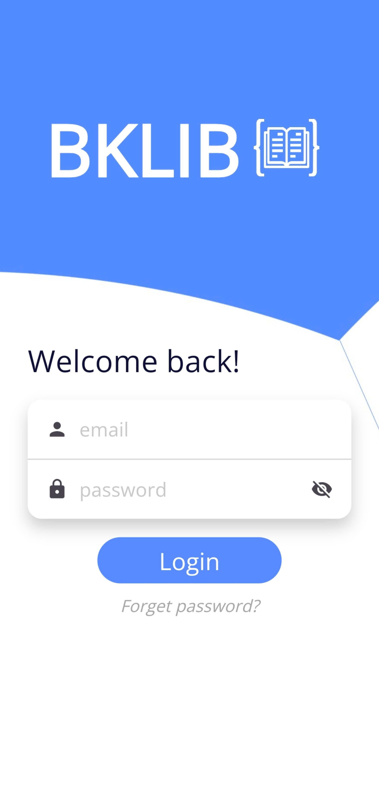
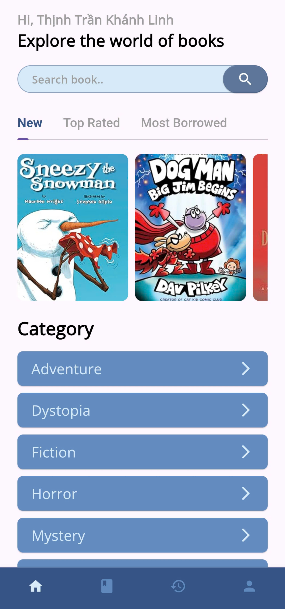
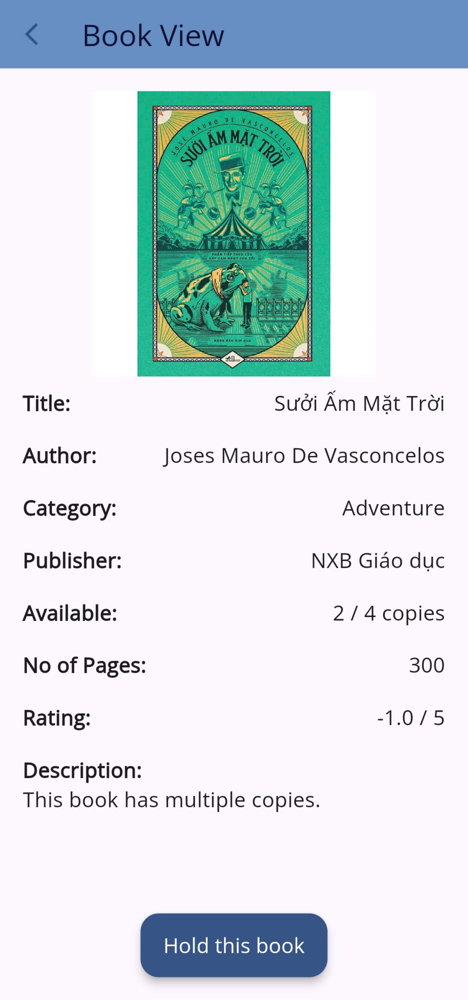
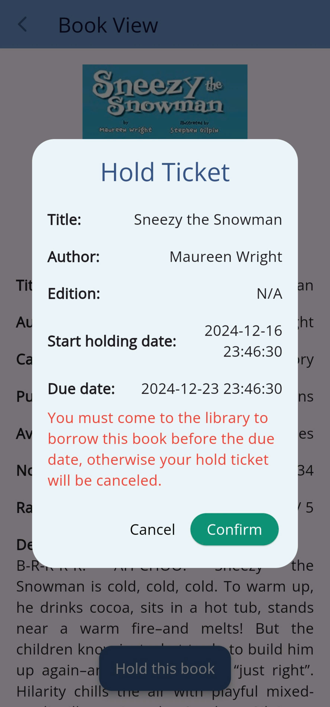
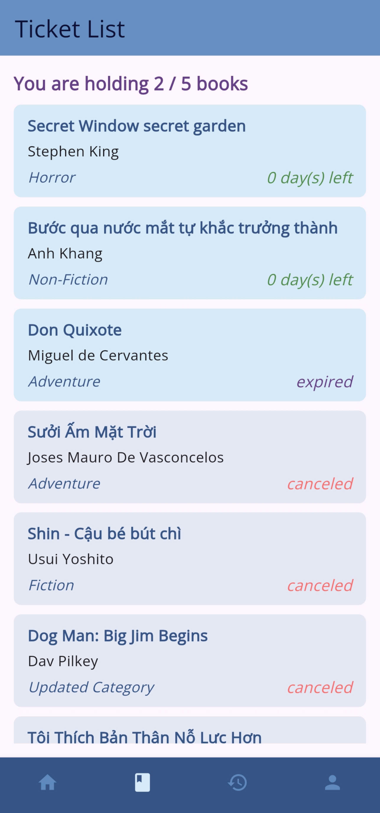
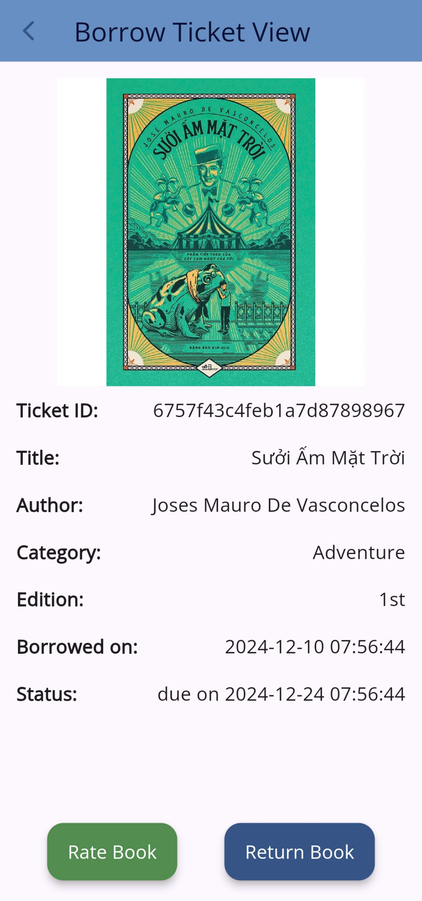
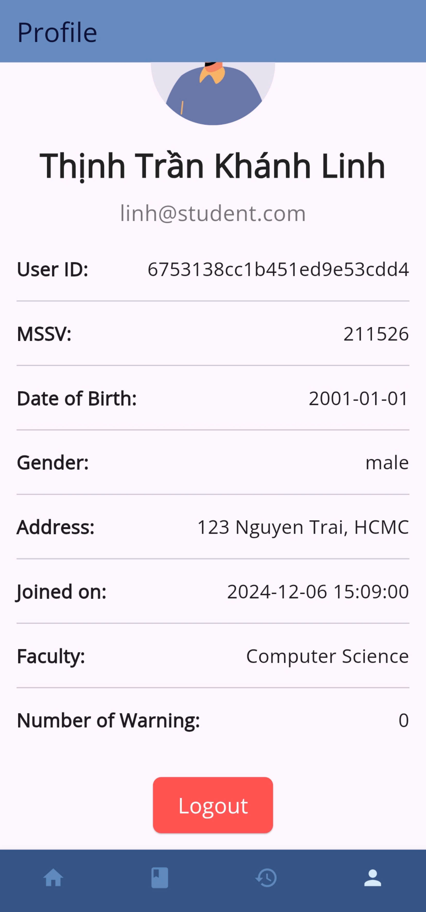

# Library-Management-System

## Requirements
- Flutter SDK
- NodeJS
- Android Studio/VSCode (with physical device or emulator)

## Installation
Clone the repository.
```bash
git clone https://github.com/NIaLliceH/Library-Management-System.git
```

### Backend
```bash
cd backend
npm install
node app.js
```

### Frontend (mobile)
```bash
cd frontend
flutter run
```
Login credentials: `linh@student.com` - `password123`

### Frontend (web)
```bash
cd web
npm install
npm run dev
```
Open browser and go to `http://localhost:5173`
Login credentials: `admin@admin.com` - `password123`

## Features
- Login/Logout
- Home screen: search bar, category list, book list
- View book detail
- Hold a book
- Hold ticket list: view, cancel
- Borrow ticket list: view, return QR, rate book
- Profile screen

## Screenshots

- Login screen


- Home screen


- Book view


- Hold ticket


- Ticket list screen


- Borrow ticket view


- Profile screen


---
That's all! Happy coding!